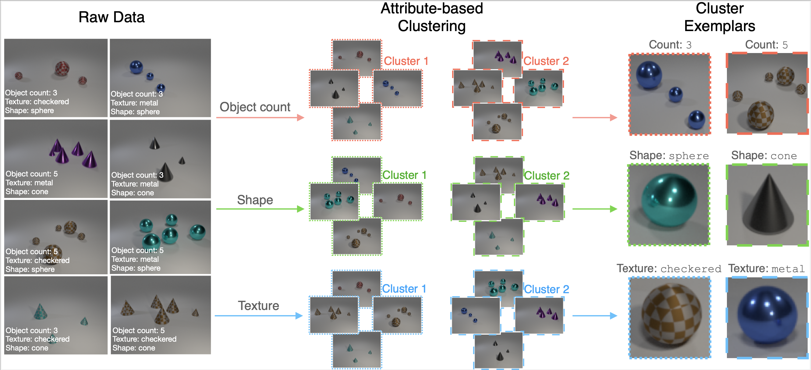

# Clevr-4
This repo contains a starter Jupyter Notebook and utilities for the Clevr-4 dataset.



## Summary

Clevr-4 is a synthetic dataset where image generation is conditioned on four attributes, based on object: *texture*, *shape*, *color*, *count*.

As a result, the dataset contains four equally valid clusterings of the same set of images. Each clustering (a.k.a 'taxonomy') has 10 categories (i.e 10 possible values for each of texture, shape, color and count.)

Example applications are in research on representation learning and category discovery.

More information is provided on the webpage [here](https://www.robots.ox.ac.uk/~vgg/data/clevr4/).

## Download

There are two versions of the dataset, one with 10k images (used in the original paper) and one with 100k images. The 10k set contains some class imbalance. The links for these are provided below:


## Citation

If you use this code in your research, please consider citing our paper:
```
@InProceedings{vaze2023clevr4,
               title={No Representation Rules Them All in Category Discovery},
               author={Sagar Vaze and Andrea Vedaldi and Andrew Zisserman},
               booktitle={Advances in Neural Information Processing Systems 36},
               year={2023}
}
```

